# fakewebshop
A fake webshop for porfolio in attempt to for apply developer jobs

## Table of Contents

- [Description](#description)
- [User roles](#user-roles)
- [Core Features](#core-features)
- [Technologies](#technologies)
- [Sitemap](#sitemap)

# Description
- Goal: imitate a webshop with fake items, user and order handling, mock ordering and paying. 
- The project's backlog using GitHub's Kanban board: https://github.com/users/MoSzabina/projects/1

## Goal
This project is a fictional e-commerce web application created as a portfolio project to demonstrate my web development and software development skills in a complete, real-world-like application.

The main reason for creating the project is to gain practical experience by designing and developing a web application from the ground up, while documenting the development process and the decisions made along the way. The shop will not involve real payments or purchases; all products, orders and transactions are fictional.
## Skills to be highlighted
- **Project planning** – breaking down a larger project into smaller, manageable tasks
- **Requirements analysis** – identifying and defining the application's functional requirements
- **UI/UX design** – designing the application's interface and user experience
- **Database design** – planning and structuring the application's data model
- **Software architecture** – designing the structure and interaction of the application's components
- **Backend development** – implementing server-side functionality and business logic
- **REST API development** – designing and implementing endpoints for client-server communication
- **Frontend development** – creating the user-facing application
- **Authentication & authorization** – managing users, authentication and access permissions
- **Version control** – using Git and GitHub to track changes and manage the development process (mostly from terminal)
- **Documentation** – documenting requirements, architecture, development decisions and usage
- **Testing & debugging** – testing functionality and identifying and resolving problems
- **Problem solving** – researching and solving development challenges independently
- **Controlled use of AI tools** – using AI for brainstorming, exploring ideas, researching unfamiliar concepts and troubleshooting, while independently reviewing, understanding and validating the results

# User roles
## Admin
- Manage products
- Manage categories
- Manage users
- Manage orders
- Manage inventory
- View basic sales and order statistics

## Guest user
- Browse products
- View product details
- Search and filter products
- Browse categories
- Add and remove products from the cart
- Register an account
- Log in

## Registered user
- All guest functionality
- View order history
- View order details
- Gain credits
- Manage profile
- Log out

# Core Features
## Product catalogue
- Browse products
- Browse products by category
- View product details
- Search products
## Shopping cart
- Add products to cart
- Remove products from cart
- Change product quantity
- View cart items
- Calculate subtotal and total
## Checkout & orders
- Guest checkout
- Customer checkout
- Enter shipping information
- Review order before placing it
- Place a fictional order
- Display order confirmation
- Check credit balance
- View order details
## User accounts
- Register
- Log in / log out
- View own order history (while logged in)
- Edit shipping, password
- View credit balance and history
- View purchased items
## Administration
- Admin login
- Manage products (create, edit, delete)
- Manage categories
- Manage orders
- Manage users
- Manage stock/inventory
- View statistics
## System features
- Authentication
- Authorization / role-based access
- Form validation
- Error handling
- Responsive design

# Technologies

## Backend

- PHP 8.5
- Laravel 13
- Eloquent ORM
- Laravel Fortify

## Database

- SQLite

## Frontend

- React
- TypeScript
- Inertia.js
- Tailwind CSS
- Vite

## UI & Components

- Radix UI
- Lucide React
- Recharts

## Development & Design

- GitHub
- GitHub Projects
- Figma
- NanoBanana

## Other Features

- EN/HU localization
- Dark mode

# Sitemap

**Home**

**About**

**Privacy**

**Products**

* Categories
* Product Listing

  * Product Details

**Login / Registration**

**Credits**

* Credit History

**Profile**

* Order History

  * Order Details
* Credits

**Cart**

**Checkout**

**Admin Dashboard**

* Product Management
* User Management
* Order Management

# Screenshots

<figure>
    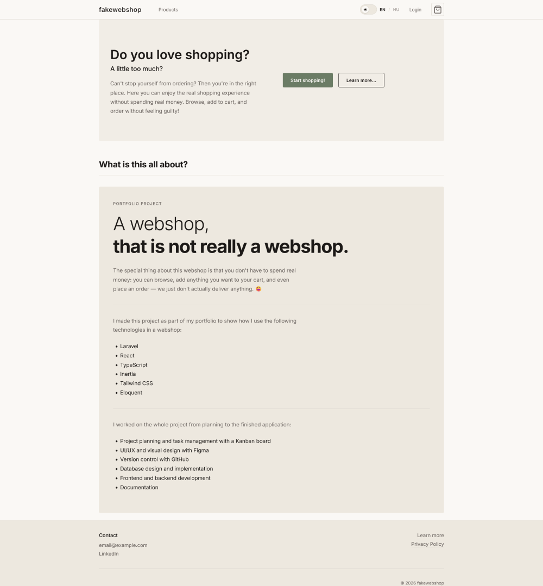
    <figcaption>Home - lightmode, desktop</figcaption>
</figure>

<figure>
    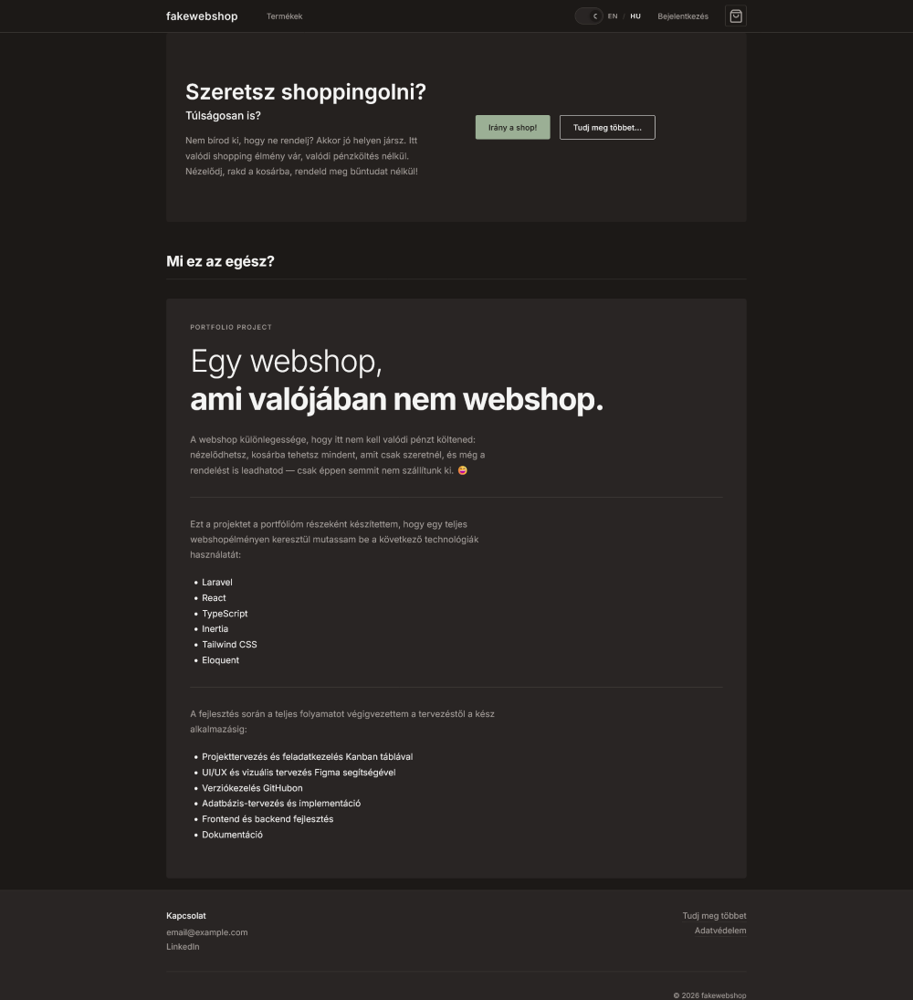
    <figcaption>Home - darkmode, desktop, Hungarian</figcaption>
</figure>

<figure>
    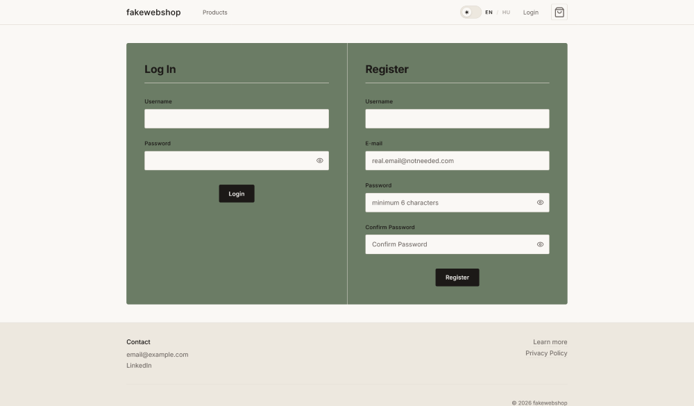
    <figcaption>Login/Register - lightmode, desktop</figcaption>
</figure>

<figure>
    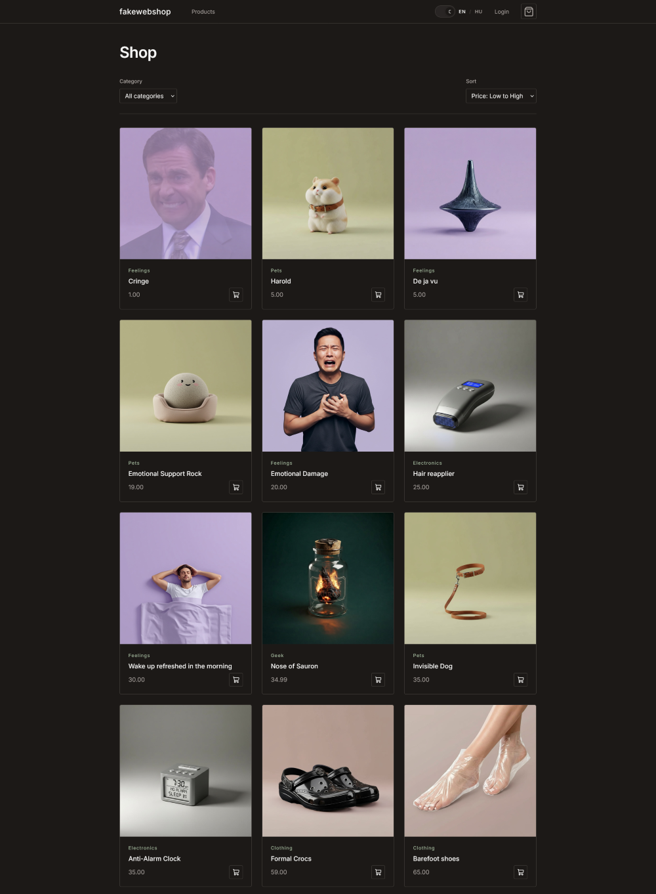
    <figcaption>Products - darkmode, desktop</figcaption>
</figure>

<figure>
    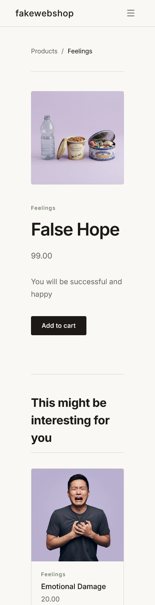
    <figcaption>Product page - mobile</figcaption>
</figure>

<figure>
    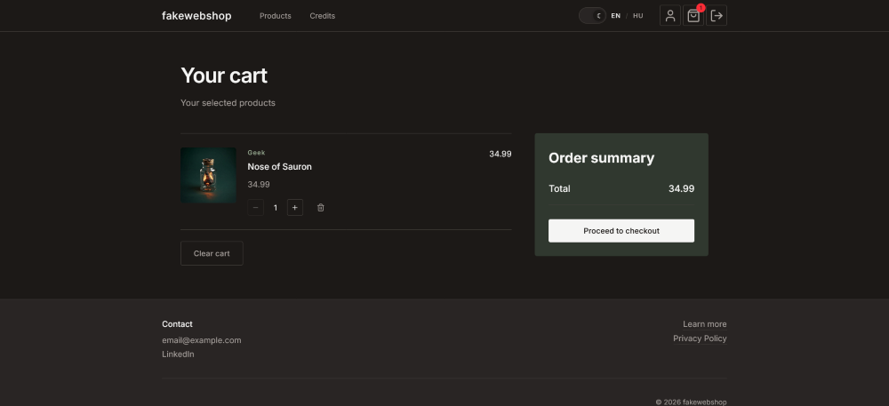
    <figcaption>Cart - darkmode, desktop</figcaption>
</figure>

<figure>
    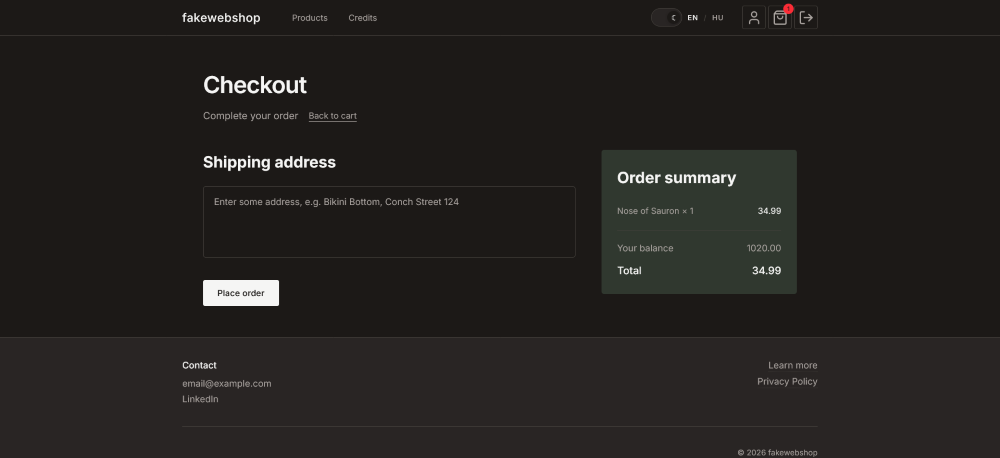
    <figcaption>Checkout - darkmode, desktop</figcaption>
</figure>

<figure>
    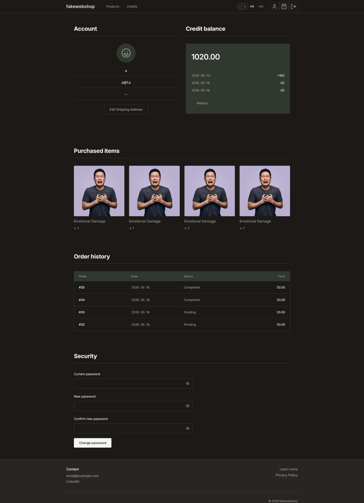
    <figcaption>Profile - darkmode, desktop</figcaption>
</figure>

<figure>
    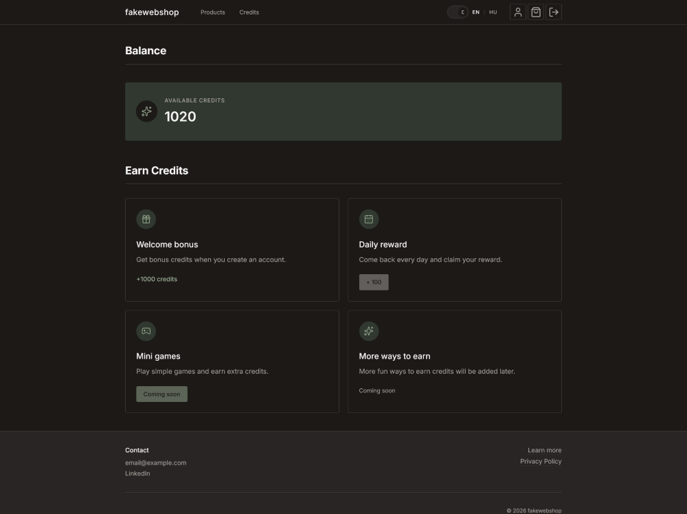
    <figcaption>Credits - darkmode, desktop</figcaption>
</figure>

<figure>
    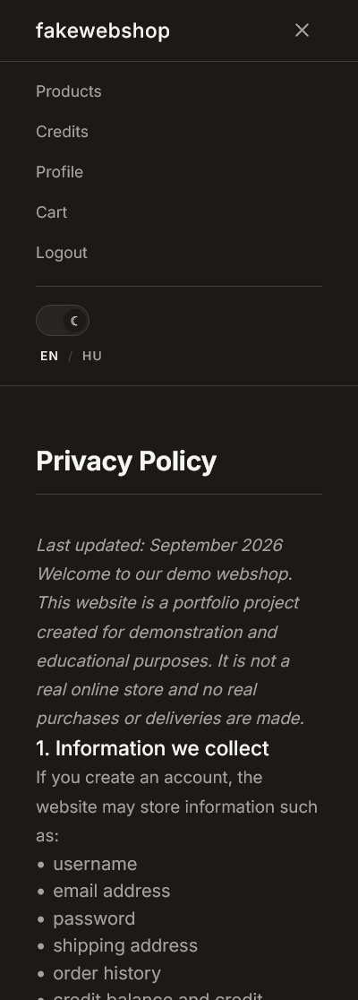
    <figcaption>Privacy, hamburger menu - darkmode, mobile</figcaption>
</figure>

<figure>
    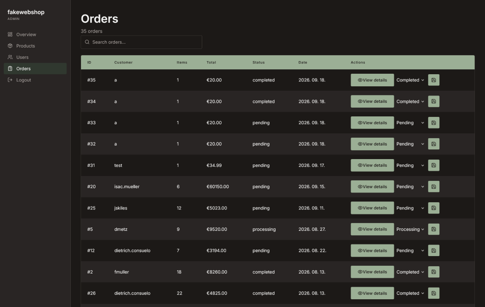
    <figcaption>Admin dashboard - darkmode, desktop</figcaption>
</figure>

<figure>
    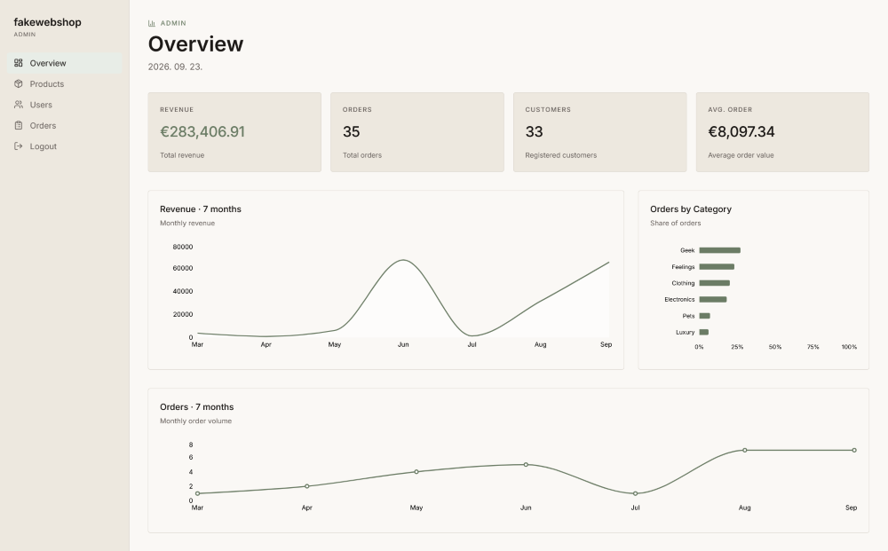
    <figcaption>Admin dashboard - darkmode, desktop</figcaption>
</figure>
